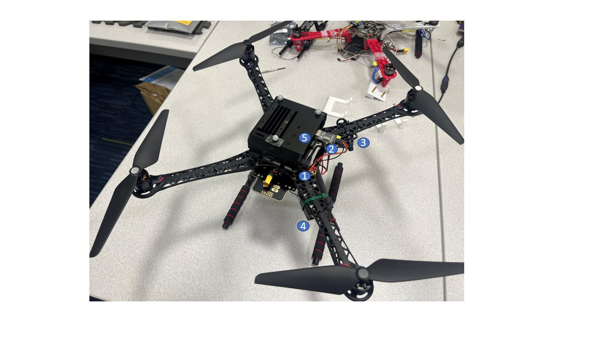

# uav_docs
# Harware


1. Jetson Nano's power cable
2. usb-serial port
3. Jetson Nano's power regulator
4. radio receiver
5. wifi

# Software

## Overview

Very standard px4+ros+viron software setup. The only non-standard part is the frame transform script in the vicon bridge package. Most questions can be answered by the official guide of px4 and mavros.

## Flight Controller

The flight controller is a [Pixhawk 4](https://docs.px4.io/en/flight_controller/pixhawk4.html) running [PX4](https://px4.io/), without any modification.

## Onboard Software

The onboard software is composed of two parts: [MAVROS](http://wiki.ros.org/mavros) and [vicon_bridge](http://wiki.ros.org/vicon_bridge), with only a minor modification on `vicon_bridge`.


PX4 User guide: https://docs.px4.io/main/en/

PX4 ROS1 with MAVROS guide: https://docs.px4.io/main/en/ros/ros1.html

## Ground Station

QGC: https://docs.qgroundcontrol.com/en/

## Nodes


The ROS workspace is located at `/home/iconlab/Workspaces/px4_ws`.
There are two packages in the workspace: `vicon_bridge` and `vicon_mavros_px4`.

### vicon_bridge

repo: https://github.com/LXYYY/vicon_bridge, branch master.
The only different from the official vicon bridge is a tf transform python [script](https://github.com/LXYYY/vicon_bridge/blob/master/src/tf_to_pose) to transform the vicon frame to the px4 frame, in a similar style of vision odometry, like a visual SLAM or realsense t265. Which means it can be validated following [the official guide of validating VIO on PX4](https://docs.px4.io/main/en/computer_vision/visual_inertial_odometry.html#check-verify-vio-estimate).
All it does is to set the starting pose of the drone in the vicon  frame, as the origin of the odometry frame, and rotate the axes of the vicon frame to the px4 odometry frame.

*if you have a target position in the vicon frame, you need to transform it to the px4 frame before sending it to the drone, otherwise the drone will fly to a wrong position.*

### vicon_mavros_px4

repo: https://github.com/LXYYY/vicon_mavros_px4.git, branch master.
A collection of a launch file and a config file.

breakdown the launch file:

```xml
       <arg name="fcu_url" default="/dev/ttyUSB0:115200" />
        <arg name="gcs_url" default="udp://:14551@192.168.1.29:14550" />
        <arg name="tgt_system" default="1" />
        <arg name="tgt_component" default="1" />
        <arg name="log_output" default="screen" />
        <arg name="fcu_protocol" default="v2.0" />
        <arg name="respawn_mavros" default="false" />

        <include file="$(find mavros)/launch/node.launch">
                <arg name="pluginlists_yaml" value="$(find mavros)/launch/px4_pluginlists.yaml" />
                <arg name="config_yaml" value="/home/iconlab/Workspaces/px4_ws/src/vicon_mavros_px4/launch/px4_config.yaml" />

                <arg name="fcu_url" value="$(arg fcu_url)" />
                <arg name="gcs_url" value="$(arg gcs_url)" />
                <arg name="tgt_system" value="$(arg tgt_system)" />
                <arg name="tgt_component" value="$(arg tgt_component)" />
                <arg name="log_output" value="$(arg log_output)" />
                <arg name="fcu_protocol" value="$(arg fcu_protocol)" />
                <arg name="respawn_mavros" default="$(arg respawn_mavros)" />
        </include>
```

The lines to start the mavros node, to connect px4 to ros. Note the `gcs_url` arg line, `<arg name="gcs_url" default="udp://:14551@192.168.1.29:14550" />`, here the ip needs to be the ip of your laptop. Only so can the QGC running on your laptop connect to the drone. The MAVROS node will transfer the drone's data to the QGC.

```xml
  <!-- IP and port on Vicon Windows PC -->
  <arg name="datastream_hostport" default="192.168.1.2:801"/>
  <!-- Fixed vicon world frame -->
  <arg name="vicon_world_frame" default="/vicon_world"/>


	<node pkg="vicon_bridge" type="vicon_bridge" name="vicon" output="screen" >
		<param name="stream_mode" value="ServerPush"/>
    <param name="datastream_hostport" value="$(arg datastream_hostport)"/>
		<param name="tf_ref_frame_id" value="$(arg vicon_world_frame)"/>
	</node>

	<node pkg="vicon_bridge" type="tf_to_pose" name="tf_to_pose" output="screen" >
	<remap from="vicon_tf" to="/vicon/icon_s500_1/icon_s500_1"/>
	<remap from="mavros_pose" to="/mavros/vision_pose/pose_100hz"/>
</node>
```

These lines launch the vicon bridge node. The `/vicon/icon_s500_1/icon_s500_1` is the original output topic of the vicon bridge, which is the pose of the drone in the vicon frame, and 100 hz.

The `/mavros/vision_pose/pose_100hz` is the topic of the pose of the drone in the odometry frame, which is the output of the tf transform script. The `tf_to_pose` node subscribes to the vicon pose topic, and publishes the pose in the px4 frame.

```xml
    <node pkg="topic_tools" type="throttle" name="throttle" args="messages /mavros/vision_pose/pose_100hz 30.0 /mavros/vision_pose/pose" />
```

the last line is to throttle the topic, to make sure the topic is published at 30 hz, which is the frequency of the px4 odometry topic.

# Fly

## Drone Setup

Calibrate the drone in QGC, if you haven't use the drone for a while, or the hardware has been changed, or the drone can hover at position, but vibrates a lot.

Guide: https://docs.px4.io/main/en/config/

Go through the guide as much as you can, especially: Sensor oritation, Compass, Gyroscope, Accelerometer, Level Horizon Calibration, Radio Setup, Flight Modes, Battery, and Safety.

Critically, must remember:
1. The battery MUST be calibrated before you do anything when using a new drone, reflashing the firmware, or changing to different size of battery. There will be NO WAY to stop the drone once it's armed(or even earlier), if the battery is not calibrated, unless you physically catch it.
2. Radio Setup and Flight Modes setup, remember which switch you set to change between flight modes, and which switch you set as the kill switch. You MUST remember the kill switch, and ready to use it at any time.
3. A newly flashed firmware will red-mark any steps you need to do before flying, but not a firmware that's already been used. So be careful when you need to calibrate the drone again.

## Build

```bash
ssh iconlab@192.168.1.24 # password: iconlab , and the ip is the ip of the drone that's already been setup.
mkdir -p ~/Workspaces/px4_ws/src
cd ~/Workspaces/px4_ws/src
git clone https://github.com/LXYYY/vicon_mavros_px4.git
git clone https://github.com/LXYYY/vicon_bridge.git
catkin init
catkin config --extend /opt/ros/melodic
catkin config --cmake-args -DCMAKE_BUILD_TYPE=Release
catkin config --merge-devel
catkin build
```

## Run

1. 

```bash
        ssh iconlab@192.168.1.24
        source ~/Workspaces/px4_ws/devel/setup.bash
        roslaunch vicon_mavros_px4 vicon_mavros_px4.launch
```

2.  turn on the vicon system, there is object config already in the vicon software, create a new object if you want to use a different drone.
3. Open QGC on your laptop, it should connect to the drone automatically, if the `gcs_url` is set correctly.
4. If everything is setup correctly, you should be able to see the drone's flight mode as `Position` in green color in QGC.

But position mode doesn't guarantee the drone will fly normally. There are a few validation steps to do if you are not 100% confident.

1. Very important: Official VIO validation. Because we transform the vicon pose following the same style of VIO, we can use[the official guide of validating VIO on PX4](https://docs.px4.io/main/en/computer_vision/visual_inertial_odometry.html#check-verify-vio-estimate).

2. Put ROS on your laptop in multi machine mode, as the drone's ip as the master. and then turn on rviz, and subscribe to the topic `local_position/pose`, and/or visualize the tf tree. Move the drone slightly by hands, see if the visualization moves along the drone. If it does, then the tf transform is correct.

```bash
        export ROS_MASTER_URI=http://<drone_ip>:11311
        export ROS_IP=<laptop_ip>
```

## Develop

Remember this is a very standard setup, follow the official tutorial:
https://docs.px4.io/main/en/ros/mavros_offboard_python.html

Please try on the simulation before flying the real drone.

Please figure out the frame transformation tree before trying to control the drone.